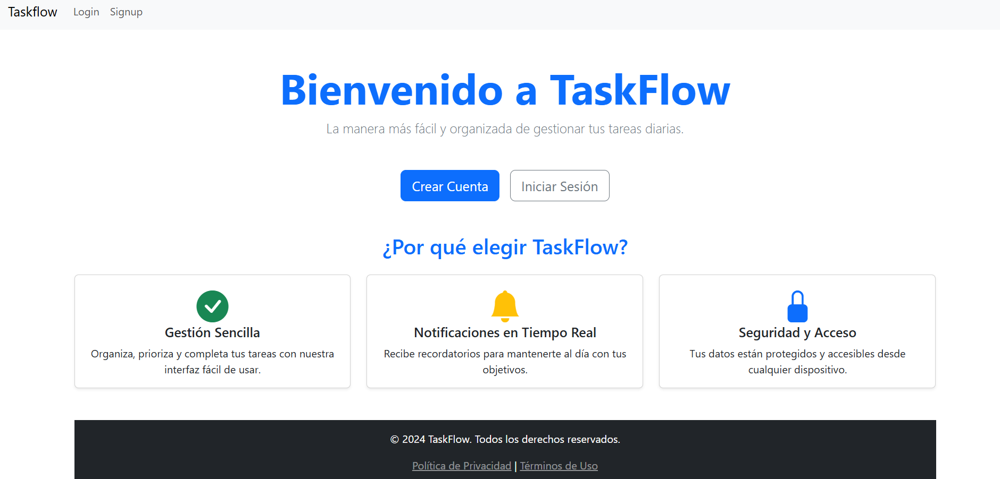
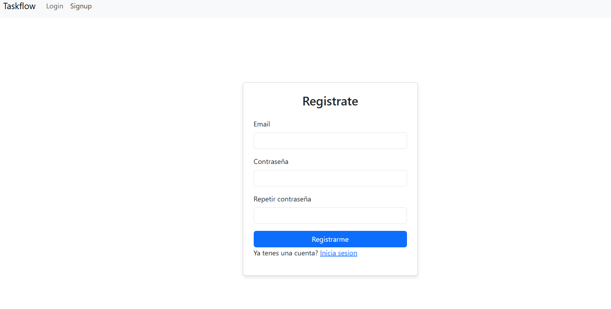
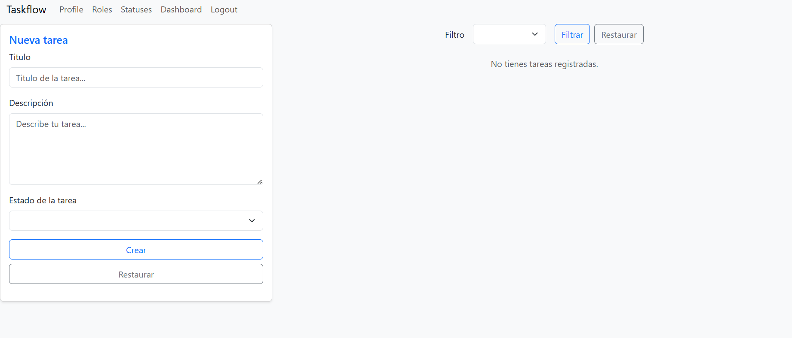
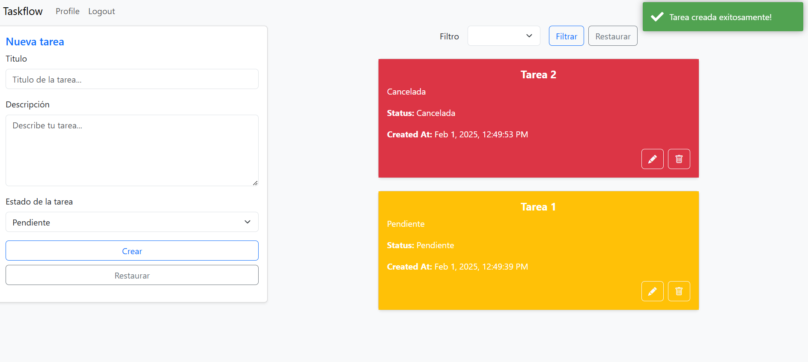
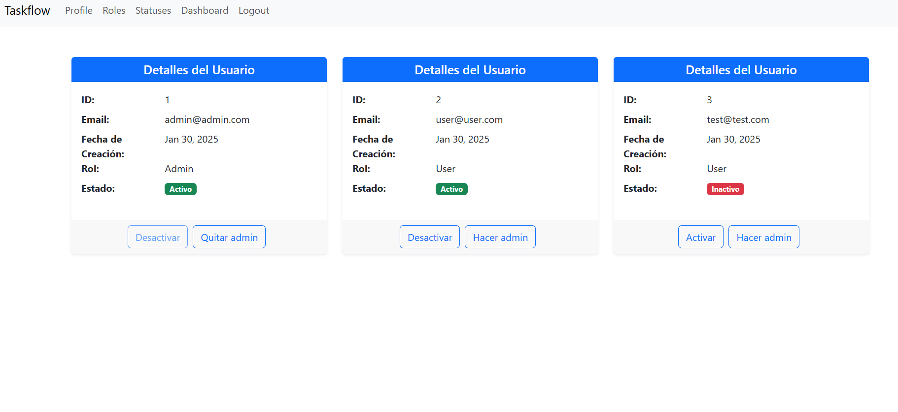

# Taskflow

## 📌 Descripción

Gestor de tareas desarrollado con **.NET**, **Angular** y **SQL Server**. Desplegado en **Azure** y disponible en el siguiente [link](https://taskflowclient.azurewebsites.net/).

[Documentacion](https://taskflowapi.azurewebsites.net/index.html)

## 🚀 Características

La aplicación es una SPA que distingue entre dos tipos de usuarios: Admin y User. Según el rol (que se obtiene de los claims del token) se permite acceder a diferentes rutas y endpoints protegidos por guards y policies respectivamente.

Un nuevo usuario puede acceder a la aplicación registrándose (por defecto se asigna el rol User). Tras un registro exitoso, el usuario puede iniciar sesión y acceder al CRUD de tareas y a una vista de perfil donde puede cerrar sesión y desactivar su cuenta.

Si se inicia sesión como Admin, además de lo descrito anteriormente, se tiene acceso al CRUD de roles, al estado de las tareas y a un dashboard de usuarios donde puede cambiar los roles y activar/desactivar cuentas.

## 🛠️ Tecnologías utilizadas

- **.NET**
- **Entity Framework**
- **JWT**
- **SQL Server**
- **Angular**
- **Bootstrap**
- **Azure**

## 📖 Uso

Registrarse como nuevo usuario y acceder a la aplicación o usar alguno de los dos siguientes ya existentes:

- Para acceso de Admin: admin@admin.com y contraseña "contrasenia"
- Para acceso de User: user@user.com y contraseña "contrasenia"

## 🤝 Contribución

Algunas mejoras que se me ocurren:

- Mejorar la UI tanto estéticamente como en responsiveness.
- Agregar más filtros, por ejemplo: filtrar por fecha de creación/actualización ascendente y descendente las tareas. Filtrar usuarios por email, rol o estado de la cuenta.
- Implementar el refresh token. Actualmente, si el token está vencido, se desloguea al usuario en lugar de refrescar el token.
- Optimizar las consultas a la base de datos utilizando más LINQ. Varias queries traen campos que no son necesarios.
- Extender el modelo de perfil, ya sea agregando más campos al existente o creando uno nuevo que tenga relación 1-1 con el de cuenta.
- Testear

## 🎨 Capturas de pantalla

Landing

Login  
  
Registro  
  
Home admin  
  
Home user  
  
Admin dashboard  

## 📌 Autor

[Faustino Luchetti](https://github.com/fluchetti45)
